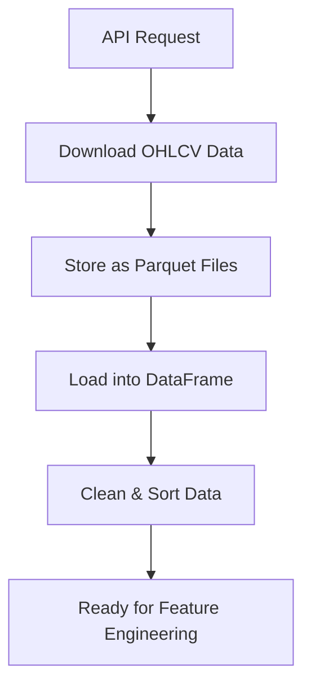
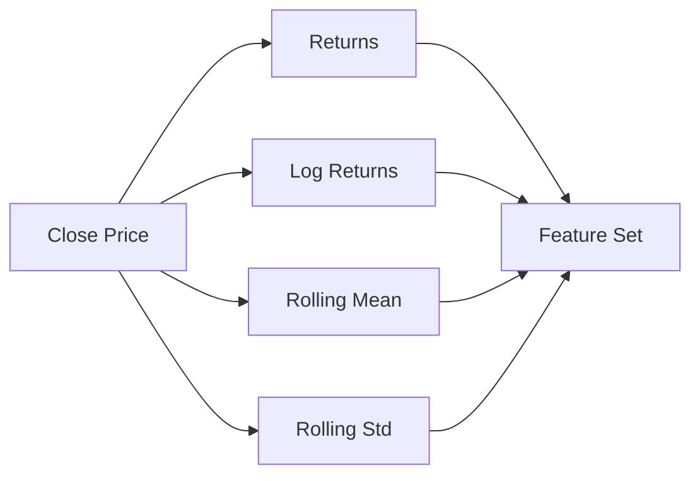
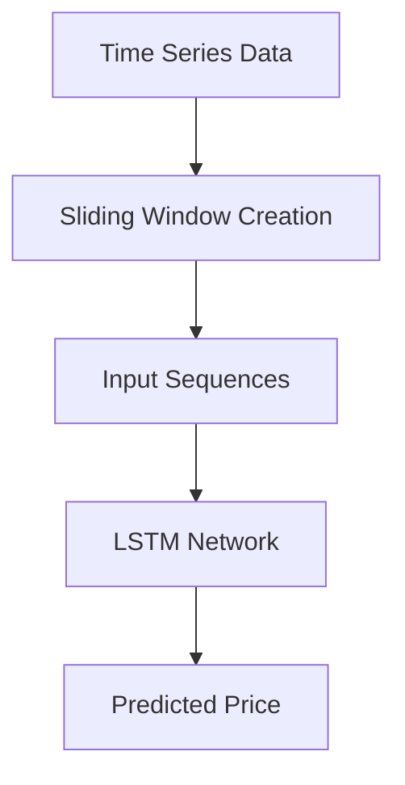

# Cryptocurrency Time-Series Forecasting Project

## Overview

This project develops an end-to-end pipeline for **cryptocurrency time-series analysis and forecasting** using high-frequency market data. The workflow integrates **data acquisition, preprocessing, feature engineering, and deep learning modeling**, focusing on reproducibility and scalability.

---

## System Architecture


---

## Data Pipeline



---

## Feature Engineering Process



---

## Model Workflow (LSTM)



---

## Data Collection

* Source: Binance API
* Assets: BTC, ETH, ADA, etc.
* Time Range: 2021 – Present
* Frequency: configurable (1m, 15m, etc.)

Dataset scale:

* ~500K rows per coin (15m)
* Millions of rows (1m)

---

## Project Structure

```text
crypto_project/
│
├── crypto_api_lstm_puhti_Ahmadinia.ipynb   # Main notebook
├── data/                                   # Raw data (excluded)
├── models/                                 # Trained models (excluded)
├── checkpoints/                            # Training checkpoints (excluded)
├── results/                                # Outputs (excluded)
├── logs/                                   # Logs (excluded)
└── .gitignore
```

---

## Computational Environment

* Platform: **CSC Puhti (HPC)**
* Parallel processing for large datasets
* Long-running training jobs (~hours)

---

## Reproducibility

To reproduce:

1. Set parameters:

   * `START_DATE`
   * `INTERVAL`
   * `SYMBOLS`
2. Run notebook sequentially
3. Data will be downloaded automatically via API

---

## Limitations

* High computational cost for 1-minute data
* Long data preparation time (~hours)
* Market volatility and noise

---

## Future Work

* Transformer models (attention-based)
* Hyperparameter tuning
* Multi-asset modeling
* Real-time prediction system

---

## Author

**Hamed Ahmadinia**

Data Analytics & Machine Learning

---

## Notes

Raw datasets, models, and intermediate outputs are excluded from GitHub due to size and reproducibility considerations.
